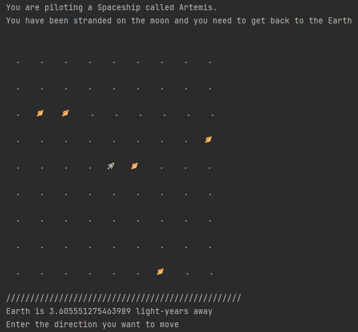
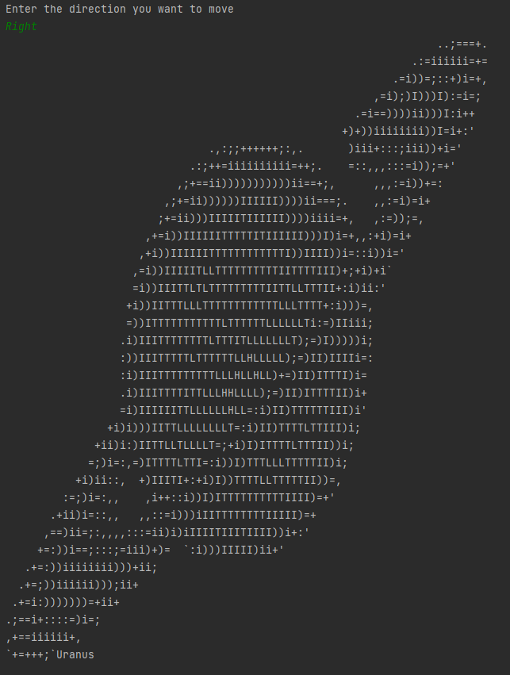
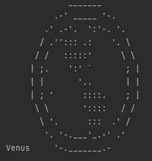
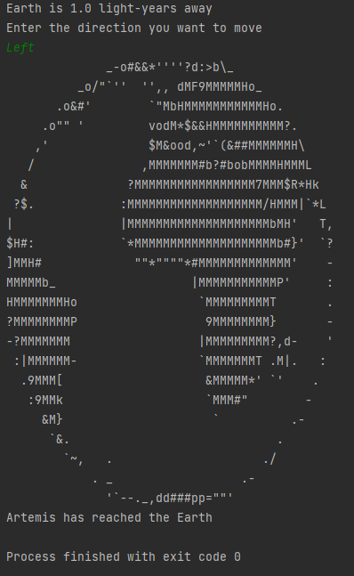

# Save Artemis - Text based game

Author: Orestas Dulinskas

### Specifications

Written in Java 17 JDK
Used IntelliJ IDEA Community Edition 2021.3.1

### Description

Text based game with an objective to help Artemis find and reach Earth.

Game begins with terminal displaying a map.

Artemis (you) is displayed in the middle and all the planets are displayed in the same icons in randomly assigned coordinates. 
Then you are given the distance between Artemis and Earth. 

You navigate the space by typing in the terminal Up, Down, Left or Right. With each move, the distance between Artemis and Earth changes. 

You can visit and discover other planets as well, such as Mars, Jupiter and Uranus.

_____

Game is finished when Artemis reaches Earth

